# Day 01: Load Balancers

Last updated: May 8, 2026

## Learning Outcomes

By the end, you should be able to:

- Explain why load balancers exist using everyday examples.
- Compare DNS, Layer 4, Layer 7, internal, external, global, and regional load balancers.
- Choose algorithms like round robin, least connections, weighted routing, consistent hashing, and latency-aware routing.
- Design health checks, failover, connection draining, sticky sessions, TLS termination, and observability.
- Apply load balancing to banking and UPI-like payment flows.
- Answer interview questions about scale, reliability, latency, overload, and multi-region design.

## The One-Sentence Definition

A load balancer is a traffic manager that receives requests or connections and distributes them across multiple healthy backends so the system becomes more available, scalable, and resilient.

If one backend is like one bank counter, a load balancer is the queue manager that sends customers to available counters, avoids closed counters, and opens more counters when traffic increases.

## Table of Contents

- [1. Why Load Balancers Exist](#1-why-load-balancers-exist)
- [2. Core Vocabulary](#2-core-vocabulary)
- [3. Where Load Balancers Sit](#3-where-load-balancers-sit)
- [4. Types of Load Balancers](#4-types-of-load-balancers)
- [5. Layer 4 vs Layer 7](#5-layer-4-vs-layer-7)
- [6. Load Balancing Algorithms](#6-load-balancing-algorithms)
- [7. Health Checks](#7-health-checks)
- [8. Connection Draining](#8-connection-draining)
- [9. Sticky Sessions and State](#9-sticky-sessions-and-state)
- [10. TLS, Headers, and Client Identity](#10-tls-headers-and-client-identity)
- [11. Scaling the Load Balancer Itself](#11-scaling-the-load-balancer-itself)
- [12. Multi-Zone and Multi-Region Designs](#12-multi-zone-and-multi-region-designs)
- [13. Kubernetes and Microservices](#13-kubernetes-and-microservices)
- [14. Banking and UPI Case Study](#14-banking-and-upi-case-study)
- [15. Configuration Examples](#15-configuration-examples)
- [16. Observability](#16-observability)
- [17. Failure Modes](#17-failure-modes)
- [18. Interview Playbook](#18-interview-playbook)
- [19. Exercises](#19-exercises)
- [20. Glossary](#20-glossary)
- [21. Research Sources](#21-research-sources)

## 1. Why Load Balancers Exist

Imagine a banking app that lets users check balance, send money through UPI, download statements, add beneficiaries, and pay credit card bills.

At the beginning, the bank might run one application server:


This is simple, but it breaks quickly.

### Problem 1: One Server Has Limited Capacity

Every server has limits:

- CPU cores.
- Memory.
- Network bandwidth.
- Maximum concurrent connections.
- Database connection pool size.
- Thread pool size.

If one server handles 2,000 requests per second and the bank receives 20,000 requests per second during a salary-day spike, one server is not enough.

### Problem 2: One Server Is a Single Point of Failure

If the only server crashes, the whole application is down. In a banking system, this means users cannot pay, merchants cannot collect, and support gets flooded.

### Problem 3: Maintenance Becomes Risky

With one server, deployment usually means stopping the old process and starting a new one. Real systems need rolling deploys, canaries, blue-green releases, and quick rollback.

### The Load Balancer Fix

Add multiple app servers and place a load balancer in front.

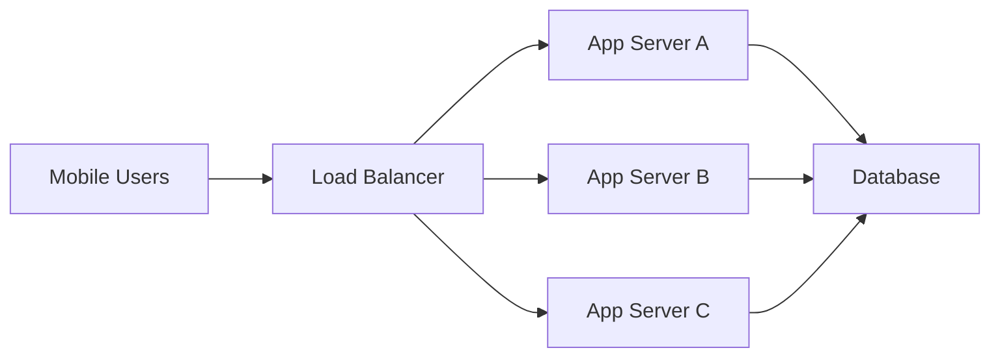

Now the load balancer can:

- Spread requests across many servers.
- Stop sending traffic to unhealthy servers.
- Add or remove servers without users noticing.
- Route specific traffic to specific services.
- Terminate TLS.
- Support safer deployments.

Load balancing is not only about performance. It is also about availability, reliability, operations, and security.

## 2. Core Vocabulary

| Term | Meaning |
| --- | --- |
| Client | User, browser, mobile app, another service, or device sending traffic. |
| Load balancer | The component that distributes traffic. |
| Backend / upstream / target | Server or service instance that actually handles the request. |
| Pool / target group | Group of backends serving the same logical function. |
| Listener | Frontend protocol and port accepted by the load balancer, such as HTTPS on port 443. |
| Rule | Logic that chooses where traffic goes, such as host-based or path-based routing. |
| VIP | Virtual IP address exposed by the load balancer. |
| Health check | Probe that decides whether a backend should receive traffic. |
| Sticky session | Routing the same client to the same backend repeatedly. |
| TLS termination | The load balancer decrypts HTTPS/TLS from clients. |
| Reverse proxy | Server-side proxy that accepts client requests and forwards them to internal services. |
| Control plane | Configuration and management logic. |
| Data plane | Hot path that handles packets, connections, or requests. |

In load balancer language, frontend means the client-facing side of the load balancer, and backend means the service-facing side.

## 3. Where Load Balancers Sit

A real request often crosses multiple balancing layers.

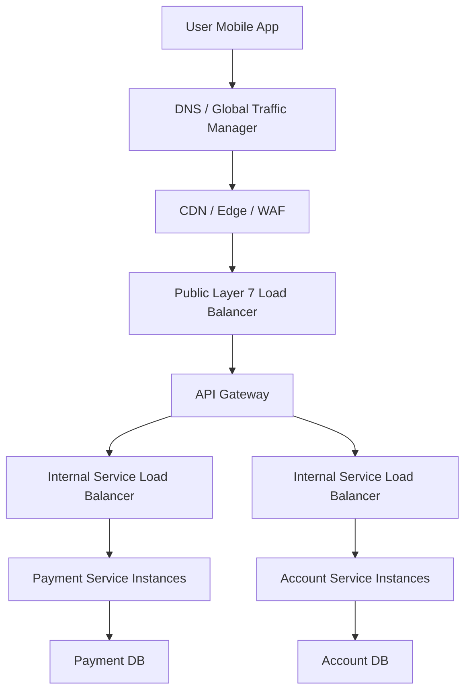

Each layer has a job:

- DNS or global traffic manager chooses a region.
- CDN or edge handles caching, WAF, and sometimes global routing.
- Public load balancer handles internet entry.
- API gateway handles API-specific concerns.
- Internal load balancer spreads service-to-service traffic.
- Service mesh or client-side load balancing may route between pods or service instances.

In system design, do not just say "use a load balancer." Say which layer, which protocol, and what failure or scaling problem it solves.

## 4. Types of Load Balancers

### 4.1 DNS Load Balancing

DNS load balancing returns different IP addresses for the same domain.

```text
api.bank.com -> 203.0.113.10
api.bank.com -> 203.0.113.11
api.bank.com -> 203.0.113.12
```

Common policies:

- Weighted routing.
- Latency-based routing.
- Geo or geoproximity routing.
- Failover routing.
- Multivalue routing.

DNS load balancing is useful for global traffic routing, region failover, and sending users to nearby endpoints.

Limitations:

- DNS caching can delay failover.
- Some resolvers ignore very low TTLs.
- DNS usually does not understand per-request load.
- DNS cannot inspect HTTP paths or headers.

Use DNS or global traffic routing to choose a region. Use regional load balancers inside that region.

### 4.2 Layer 4 Load Balancer

Layer 4 load balancing works at the transport layer. It usually understands:

- Source IP.
- Destination IP.
- Source port.
- Destination port.
- Protocol: TCP, UDP, sometimes QUIC.

It does not understand HTTP paths like `/upi/pay`.

Layer 4 load balancers are good for high throughput, low latency, non-HTTP protocols, long-lived TCP/UDP flows, databases, caches, message brokers, DNS, voice, and video.

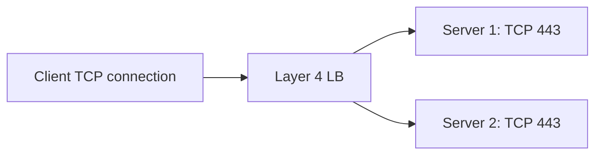

### 4.3 Layer 7 Load Balancer

Layer 7 load balancing works at the application layer. For HTTP systems, it can inspect:

- Hostname.
- Path.
- Method.
- Headers.
- Cookies.
- Query parameters.
- HTTP status codes.

Layer 7 load balancers are good for path routing, host routing, header routing, canaries, blue-green deployments, TLS termination, redirects, WAF integration, and API traffic.

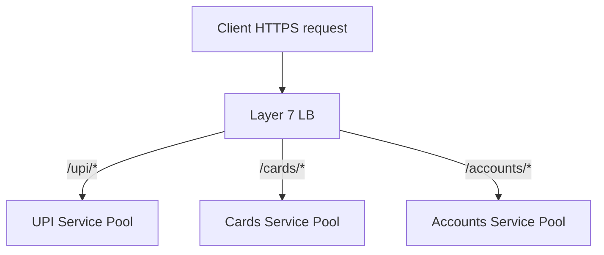

### 4.4 Internal vs External Load Balancer

External load balancer:

- Publicly reachable from the internet.
- Used for user-facing traffic.
- Often integrated with WAF, TLS certificates, DDoS protection, and public DNS.

Internal load balancer:

- Private IP inside a VPC, VNet, data center, or Kubernetes cluster.
- Used for service-to-service traffic.
- Not directly reachable from the public internet.

Banking example:

- Public LB: mobile app calls `api.bank.com`.
- Internal LB: payment service calls risk-scoring service.
- Internal LB: UPI service calls notification service.

### 4.5 Global vs Regional Load Balancer

Global load balancer:

- Routes users across regions.
- Usually uses DNS steering, anycast, or a global proxy fleet.
- Useful for multi-region systems.

Regional load balancer:

- Handles traffic within one region.
- Often simpler and gives more jurisdictional control.

Banking systems may deliberately choose regional routing because of regulatory, data residency, or payment network constraints.

## 5. Layer 4 vs Layer 7

| Feature | Layer 4 LB | Layer 7 LB |
| --- | --- | --- |
| Sees | IP, port, protocol | HTTP host, path, headers, cookies |
| Routing unit | Connection or flow | Request |
| Latency | Usually lower | Usually higher |
| Protocol support | TCP, UDP, TLS, QUIC depending on product | HTTP, HTTPS, HTTP/2, gRPC depending on product |
| TLS handling | Can pass through or terminate TLS depending on implementation | Commonly terminates TLS |
| Path-based routing | No | Yes |
| Header/cookie routing | No | Yes |
| WAF integration | Limited | Common |
| Best for | Raw performance and non-HTTP traffic | Web APIs and microservices |

Choose Layer 7 when HTTP-aware routing matters. Choose Layer 4 when you need transport transparency, low overhead, or non-HTTP protocol support.

## 6. Load Balancing Algorithms

An algorithm decides which backend receives the next request or connection.

### 6.1 Round Robin

Round robin sends each new request to the next backend in order.

| Request | Server |
| --- | --- |
| 1 | A |
| 2 | B |
| 3 | C |
| 4 | A |
| 5 | B |
| 6 | C |

Good when servers have similar capacity and requests have similar cost.

Weakness: it treats a light balance-check request and a heavy statement-generation request as equal.

### 6.2 Weighted Round Robin

Weighted round robin gives stronger servers more traffic.

Example:

- Server A weight 5.
- Server B weight 3.
- Server C weight 2.

Out of 10 requests, A gets about 5, B gets about 3, and C gets about 2.

Use it when backends have different capacity or when gradually shifting traffic to a new version.

### 6.3 Least Connections

Least connections sends new traffic to the backend with the fewest active connections.

| Server | Active connections |
| --- | ---: |
| A | 90 |
| B | 30 |
| C | 60 |

The next connection goes to B.

Good for long-lived or variable-duration requests.

### 6.4 Weighted Least Connections

Weighted least connections considers both active connections and backend capacity. A larger backend can safely hold more connections than a smaller backend.

### 6.5 Least Response Time

Least response time routes toward backends with lower observed latency, often combined with connection count. It adapts to slow servers, but can overreact to noisy measurements.

### 6.6 Random

Random selection can work well at large scale, especially when many load balancer instances route independently and do not share perfect global state.

### 6.7 Power of Two Choices

Power of two choices:

1. Pick two random backends.
2. Choose the better one, usually the one with fewer active requests or lower latency.

It gives much better balance than pure random without checking every backend.

### 6.8 Source IP Hash

```text
backend = hash(client_ip) % number_of_backends
```

Good for simple affinity. Bad when many users share one NAT IP or mobile users frequently change IPs.

### 6.9 Cookie-Based Affinity

The load balancer sets or reads a cookie and routes the same browser session to the same backend.

Use this for legacy stateful apps or special cases. Prefer stateless app servers when possible.

### 6.10 Consistent Hashing

Consistent hashing maps keys to servers so adding or removing a server moves only a fraction of keys.

Used for:

- Caches.
- Sharded services.
- Stable key-to-backend routing.
- Cache locality.

Naive modulo hashing remaps many keys when `N` changes. Consistent hashing reduces that disruption.

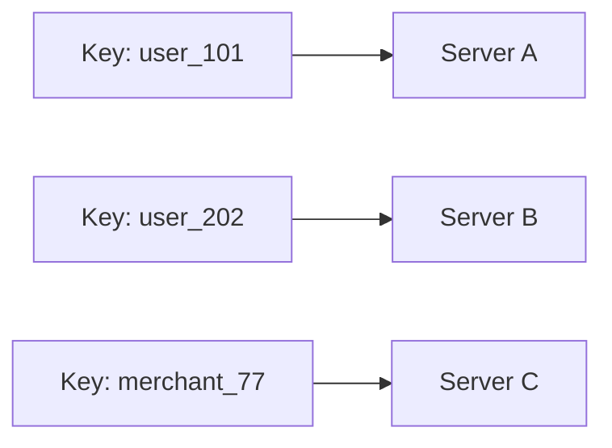

### 6.11 Algorithm Cheat Sheet

| Algorithm | Best for | Watch out for |
| --- | --- | --- |
| Round robin | Equal servers, similar requests | Heavy requests cause imbalance |
| Weighted round robin | Different server sizes, canary | Wrong weights create hotspots |
| Least connections | Long-lived or variable connections | Slow servers may look deceptively empty |
| Least response time | Adaptive performance routing | Can overreact to noisy metrics |
| Random | Distributed LB fleets | Needs enough traffic to smooth out |
| Power of two choices | Large backend pools | Requires lightweight load signal |
| Source IP hash | Simple affinity | NAT and mobile IP changes |
| Cookie stickiness | HTTP user sessions | Hides state problems |
| Consistent hashing | Cache locality, stable mapping | Uneven keys need virtual nodes or weights |
| Geo/latency routing | Multi-region UX | DNS and measurement imperfections |

## 7. Health Checks

A load balancer should not send traffic to dead or broken backends.

Health checks answer: is this backend eligible to receive new traffic?

### 7.1 Active Health Checks

The load balancer probes backends periodically.

```http
GET /healthz HTTP/1.1
Host: payment-service.internal
```

The backend returns `200 OK` when it is healthy.

Common settings:

- Protocol: HTTP, HTTPS, TCP, gRPC.
- Path: `/healthz`, `/readyz`.
- Interval.
- Timeout.
- Healthy threshold.
- Unhealthy threshold.
- Expected status codes.

### 7.2 Passive Health Checks

Passive health checks observe real traffic.

Signals include:

- Connection refused.
- Connection timeout.
- Too many 5xx responses.
- Too many resets.
- High latency.

### 7.3 Liveness vs Readiness

Liveness asks whether the process is alive. Readiness asks whether the process should receive traffic.

A process can be alive but not ready, for example while warming cache or waiting for a critical dependency.

### 7.4 Good Health Endpoint Design

For a UPI payment service, `/readyz` should check:

- App started successfully.
- Required configuration loaded.
- Database connection pool is usable.
- Critical dependencies are reachable enough for the service's role.
- Message queue producer is ready if payment events must be emitted.

Keep health checks cheap. A health endpoint that performs expensive dependency work every few seconds can become a problem itself.

### 7.5 Health Check Timing

Suppose:

- Interval = 5 seconds.
- Timeout = 2 seconds.
- Unhealthy threshold = 3 failures.

Failure detection is roughly 15 seconds, plus timeout and scheduling details.

Faster checks detect failure faster but create more probe traffic and false positives. Slower checks reduce noise but keep broken backends in rotation longer.

## 8. Connection Draining

Connection draining means stopping new traffic to a backend while allowing in-flight requests to finish.

It matters during deployments, autoscaling scale-in, manual maintenance, failed health checks, and blue-green release swaps.

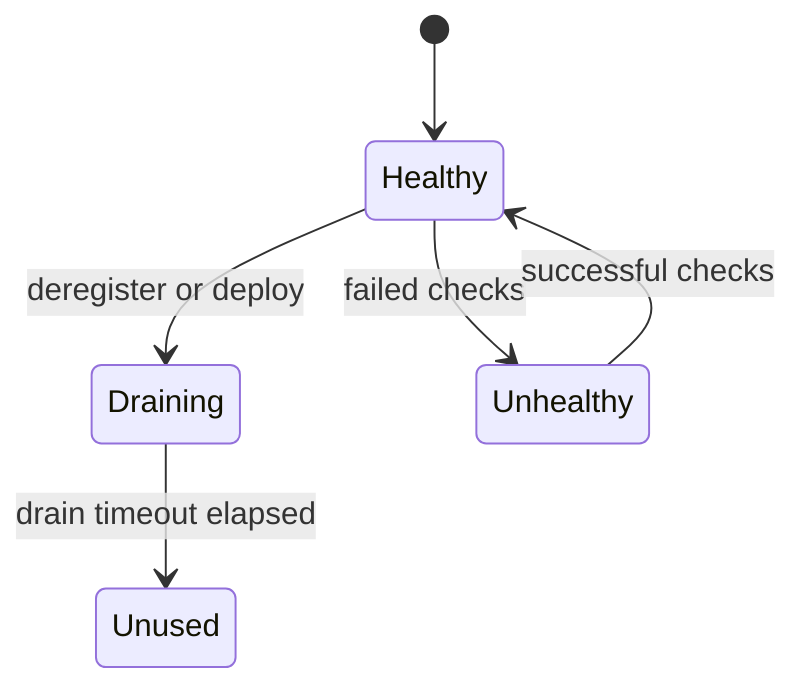

Without draining, a payment request can be killed mid-flight, the client can retry, and the transaction can become ambiguous if idempotency is weak.

Graceful shutdown checklist:

- Receive termination signal.
- Stop accepting new work.
- Fail readiness check.
- Keep the process alive long enough for LB propagation.
- Finish in-flight requests.
- Close long-lived connections carefully.
- Flush logs and metrics.
- Exit before platform kill timeout.

For payments, use idempotency keys and durable transaction state. Never rely only on in-memory state during shutdown.

## 9. Sticky Sessions and State

Sticky sessions route the same client to the same backend repeatedly.

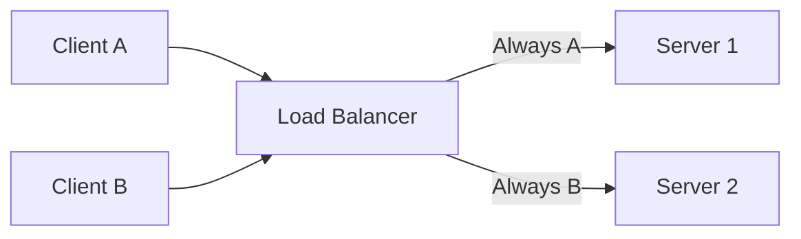

Stickiness exists because some applications store session state locally:

- Login session in memory.
- Shopping cart in memory.
- WebSocket state.
- Collaboration state.
- Cached user profile.

Sticky sessions reduce flexibility:

- Uneven load distribution.
- Session loss when a backend fails.
- Harder scale-down.
- Slow rebalancing.
- Hidden state-management problems.

Better architecture:

- Keep app servers stateless.
- Store session state in Redis, database, or signed tokens.
- Use idempotency keys for payment requests.
- Use distributed caches for shared data.

For UPI payments, sticky sessions may improve cache locality, but correctness must come from durable state and idempotency.

## 10. TLS, Headers, and Client Identity

### 10.1 TLS Termination


Options:

1. Terminate TLS at the load balancer and forward HTTP internally.
2. Terminate TLS at the load balancer and re-encrypt to backend.
3. Use TLS passthrough and let the backend terminate TLS.

For regulated systems, re-encryption or mTLS between internal services is often preferred.

### 10.2 Forwarded Headers

When a load balancer proxies a request, the backend often sees the load balancer IP as the source. Layer 7 systems commonly add:

```http
X-Forwarded-For: 203.0.113.7
X-Forwarded-Proto: https
X-Forwarded-Port: 443
```

Important rules:

- Trust forwarded headers only from trusted proxies.
- Strip or overwrite untrusted incoming forwarded headers at the edge.
- Use Proxy Protocol or source IP preservation for some Layer 4 designs.

### 10.3 Security Around Load Balancers

Common integrations:

- WAF.
- DDoS protection.
- Bot protection.
- Rate limiting.
- TLS policy enforcement.
- mTLS for service-to-service.
- IP allowlists.
- Geo restrictions.

For banking:

- Terminate public TLS at a controlled edge.
- Re-encrypt sensitive internal traffic.
- Propagate request IDs across every hop.
- Rate limit by user, device, IP, merchant, and risk signal.

## 11. Scaling the Load Balancer Itself

A load balancer can become a bottleneck if it is one machine. Production systems use redundancy and distribution.

Techniques include:

- Managed distributed load balancer fleets.
- Anycast IP addresses.
- DNS distributing across LB nodes.
- ECMP from routers to many LB machines.
- Active-active LB pairs.
- Autoscaled proxy fleets.
- Direct Server Return for some Layer 4 designs.

### 11.1 Two-Tier Load Balancing

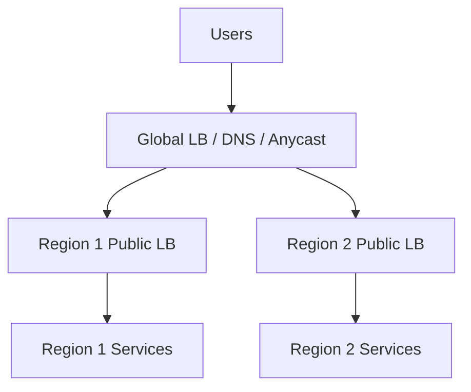

Tier 1 chooses a region. Tier 2 chooses a backend inside that region.

### 11.2 Anycast

Anycast lets multiple locations advertise the same IP. Internet routing sends users to a nearby or preferred location.

Anycast helps with global entry and network-level failover, but application correctness still needs regional health checks, data consistency, failover planning, and idempotency.

### 11.3 ECMP

Equal-Cost Multi-Path routing spreads packets across multiple equal network paths. Large LB fleets can use ECMP to distribute traffic from routers to many load balancer machines.

## 12. Multi-Zone and Multi-Region Designs

### 12.1 Multi-AZ Inside One Region

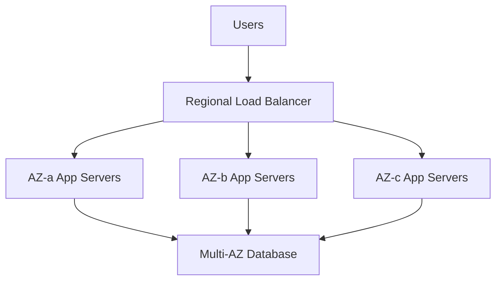

Benefits:

- One availability zone can fail.
- Traffic shifts to healthy zones.
- Rolling deploys can happen per zone.

Considerations:

- Cross-zone traffic cost.
- Cross-zone latency.
- Whether remaining zones have enough capacity after one zone fails.
- Zonal blast radius.

### 12.2 Active-Passive Multi-Region

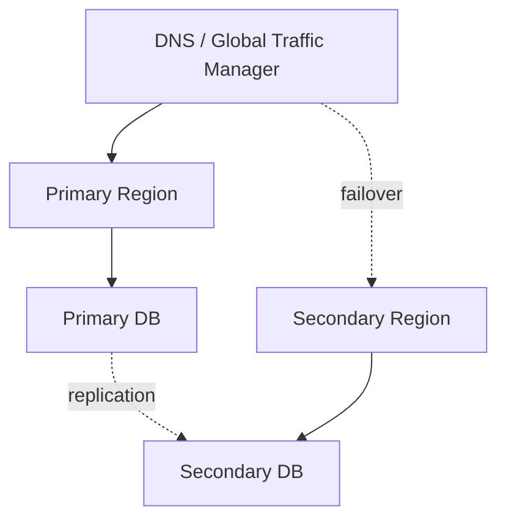

Good for simpler consistency and disaster recovery. Weaknesses include failover time, cold standby capacity, and replication lag.

### 12.3 Active-Active Multi-Region

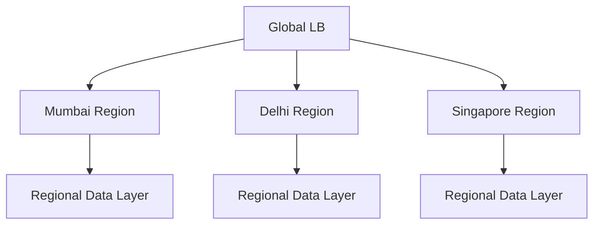

Good for low latency and high availability. Hard parts include consistency, conflict resolution, idempotency, global rate limits, regional compliance, and failover capacity.

For money movement, do not accept writes in multiple regions unless duplicate prevention and reconciliation are globally correct.

## 13. Kubernetes and Microservices

Kubernetes has several traffic layers:

- `ClusterIP`: stable internal virtual IP for a Service.
- `NodePort`: exposes a port on every node.
- `LoadBalancer`: asks the cloud provider to provision an external load balancer.
- Ingress or Gateway: Layer 7 HTTP routing into the cluster.
- EndpointSlice: scalable representation of backend pod endpoints.

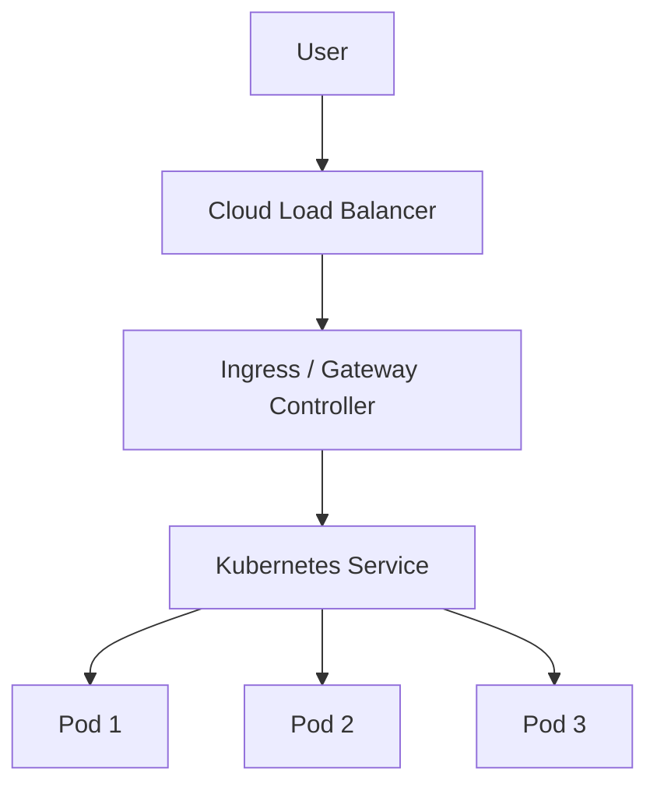

Important concepts:

- Pods are ephemeral. Services provide stable discovery.
- Endpoints change as pods scale or roll.
- Readiness probes control whether a pod receives traffic.
- Ingress/Gateway handles HTTP host/path routing.
- Service mesh sidecars can add retries, circuit breakers, mTLS, and client-side load balancing.

## 14. Banking and UPI Case Study

This is a simplified educational design, not a claim about any real bank, NPCI, or UPI implementation.

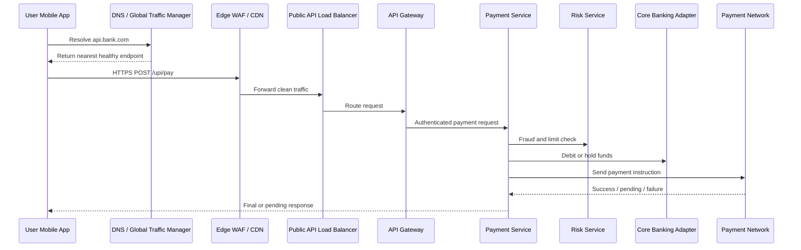

Load balancers help at several points:

- DNS/global layer sends users to the nearest healthy region.
- Edge/WAF filters abusive traffic.
- Public Layer 7 LB terminates TLS and routes `/upi/*`, `/accounts/*`, and `/cards/*`.
- Internal LBs spread traffic across payment, risk, notification, and account services.

Payment design principles:

- Make app servers stateless for correctness.
- Use idempotency keys for payment initiation.
- Persist transaction state durably.
- Do not rely on sticky sessions for transaction state.
- Use timeouts and retries carefully.
- Avoid retry storms during downstream slowness.
- Fail closed if outcome is unknown.
- Reconcile pending transactions asynchronously.

### Salary-Day Spike

Scenario:

- Normal traffic: 20,000 requests per second.
- Spike traffic: 150,000 requests per second.
- Payment requests are more expensive than balance checks.

Design choices:

- DNS routes users to a close healthy region.
- Public LB distributes requests to API gateway fleet.
- API gateway rate limits per user and device.
- Path routing separates `/upi/pay` from `/accounts/balance`.
- Payment service autoscaling reacts to CPU, queue depth, and p95 latency.
- Weighted routing slowly shifts traffic to new versions.
- Health checks remove bad instances.
- Connection draining protects in-flight payments during deploys.

### Bad Payment Release

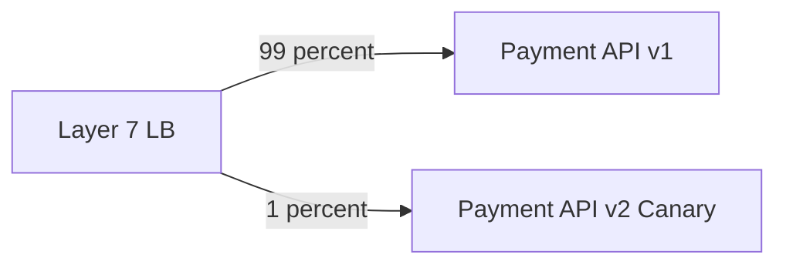

Safer deployment:

1. Deploy v2 to a small backend pool.
2. Send 1 percent of `/upi/pay` traffic using weighted routing.
3. Compare success rate, p95 latency, p99 latency, timeout rate, reversal rate, and downstream error rate.
4. Increase gradually only if metrics stay healthy.
5. Roll back by setting v2 weight to 0.

## 15. Configuration Examples

These examples are for learning, not copy-paste production use.

### 15.1 NGINX Round Robin

```nginx
upstream payment_api {
    server 10.0.1.10:8080;
    server 10.0.1.11:8080;
    server 10.0.1.12:8080;
}

server {
    listen 443 ssl;
    server_name api.bank.example;

    location /upi/ {
        proxy_pass http://payment_api;
        proxy_set_header Host $host;
        proxy_set_header X-Forwarded-For $proxy_add_x_forwarded_for;
        proxy_set_header X-Forwarded-Proto https;
    }
}
```

### 15.2 NGINX Least Connections

```nginx
upstream payment_api {
    least_conn;
    server 10.0.1.10:8080;
    server 10.0.1.11:8080;
    server 10.0.1.12:8080;
}
```

### 15.3 HAProxy HTTP Backend

```haproxy
frontend public_https
    bind :443 ssl crt /etc/haproxy/certs/api.pem
    mode http
    acl is_upi path_beg /upi/
    use_backend upi_backend if is_upi
    default_backend api_backend

backend upi_backend
    mode http
    balance leastconn
    option httpchk GET /readyz
    server upi1 10.0.1.10:8080 check
    server upi2 10.0.1.11:8080 check
```

### 15.4 Kubernetes Service Type LoadBalancer

```yaml
apiVersion: v1
kind: Service
metadata:
  name: payment-api
spec:
  type: LoadBalancer
  selector:
    app: payment-api
  ports:
    - name: http
      port: 80
      targetPort: 8080
```

### 15.5 Kubernetes Readiness Probe

```yaml
readinessProbe:
  httpGet:
    path: /readyz
    port: 8080
  periodSeconds: 5
  timeoutSeconds: 2
  failureThreshold: 3
```

## 16. Observability

Track at the load balancer:

- Requests per second.
- Active connections.
- New connections per second.
- Connection errors.
- Target connection errors.
- HTTP 2xx, 3xx, 4xx, 5xx.
- Load balancer generated 5xx vs backend generated 5xx.
- p50, p95, p99 latency.
- TLS handshake errors.
- Healthy backend count.
- Unhealthy backend count.
- Rejected requests.
- Rate-limited requests.

Track at the backend:

- CPU.
- Memory.
- Thread pool usage.
- Event loop lag.
- Queue depth.
- DB connection pool usage.
- Downstream latency.
- Error rate by dependency.

Access logs should include timestamp, request ID, trusted client IP, method, host, path, status code, backend target, request time, target time, response size, and user agent.

For payment systems, propagate a correlation ID across the mobile app, edge, load balancer, API gateway, payment service, risk service, core banking adapter, and payment network adapter.

## 17. Failure Modes

### 17.1 Hot Backend

Causes:

- Sticky sessions.
- NAT with source IP hash.
- Bad weights.
- Long-lived connections.
- HTTP/2 multiplexing.
- Uneven cache keys.

Fixes:

- Change algorithm.
- Use better affinity key.
- Add weights.
- Limit long-lived connections.
- Use request-level balancing where possible.

### 17.2 Retry Storm

Backend gets slow, clients retry, traffic multiplies, and the system gets worse.

Fixes:

- Timeouts.
- Exponential backoff with jitter.
- Circuit breakers.
- Rate limits.
- Retry budgets.
- Load shedding.

### 17.3 Thundering Herd After Recovery

A failed backend recovers and instantly receives too much traffic.

Fixes:

- Slow start.
- Gradual weight increase.
- Warm caches before marking ready.
- Keep recovered backend in low-weight state initially.

### 17.4 Health Check Lies

Health check says healthy, but real traffic fails.

Causes:

- Health endpoint too shallow.
- Health endpoint bypasses auth or routing middleware.
- Dependency failure not reflected.
- Health check uses a different thread pool from real traffic.

Fixes:

- Better readiness checks.
- Passive health checks.
- Synthetic transactions.
- Business-level metrics.

### 17.5 DNS Failover Is Slow

DNS records changed, but clients still use cached old IPs.

Fixes:

- Use low but realistic TTL.
- Use health-aware global traffic management.
- Use anycast or proxy-based global load balancing when failover speed matters.

## 18. Interview Playbook

### 18.1 Strong Load Balancer Answer

Instead of saying only "put a load balancer," say:

> I would place a public Layer 7 load balancer in front of the API fleet to terminate TLS, route by path, use health-check-based target selection, and support rolling deployments. For global availability, I would put DNS or global traffic steering in front to choose the nearest healthy region. Internal service calls would use private load balancers or service discovery.

### 18.2 Questions to Ask

- Is traffic HTTP, TCP, UDP, gRPC, or WebSocket?
- Is the system single-region or multi-region?
- Do we need path/header routing?
- Do we need strict client IP preservation?
- Are requests short-lived or long-lived?
- Are backends equal capacity?
- Do we need sticky sessions?
- What are latency and availability goals?
- What happens during partial failure?
- Are there regulatory constraints?

### 18.3 Capacity Estimation

Suppose:

- Peak traffic = 120,000 requests per second.
- One app instance safely handles 1,000 requests per second.
- Keep 40 percent headroom.

```text
raw_instances = 120,000 / 1,000 = 120
with_headroom = 120 / 0.60 = 200
```

If using 3 availability zones, that is about 67 instances per AZ. If one AZ can fail, the remaining two zones must absorb all traffic, so each remaining zone needs about 100 instances.

### 18.4 Common Questions

Q: Why not let clients choose servers directly?

A: Clients would need service discovery, health checking, retry logic, security rules, and deployment awareness. The load balancer centralizes the front door.

Q: Is a load balancer a single point of failure?

A: It can be if implemented as one machine. Production load balancers are deployed redundantly or as distributed managed fleets.

Q: What happens when a backend dies?

A: Health checks fail. The load balancer stops sending new traffic after thresholds are met. Existing connections may be drained or reset depending on protocol and failure type.

Q: What is the difference between load balancer and API gateway?

A: A load balancer primarily distributes traffic to healthy backends. An API gateway usually adds authentication, authorization, rate limiting, schema validation, request transformation, and API management.

Q: How do you support zero-downtime deployment?

A: Use multiple backends, readiness checks, rolling deployment, connection draining, slow start, canary traffic, and fast rollback through weight changes.

Q: How should payment retries work behind a load balancer?

A: Use idempotency keys and durable transaction state. Any backend should safely process a retry.

## 19. Exercises

### Exercise 1: Basic Web App

Design load balancing for 10,000 requests per second, 6 app servers, HTTP API, and one region with three availability zones.

Answer should mention a public Layer 7 LB, backend pool across zones, `/readyz`, connection draining, and autoscaling based on CPU and p95 latency.

### Exercise 2: Legacy Stateful App

The app stores login sessions in memory.

Short term: use cookie stickiness and monitor uneven load.

Long term: move sessions to Redis or signed tokens and remove stickiness.

### Exercise 3: UPI Payment API

Requirements: no duplicate payments, high availability, traffic spikes, and rollback for bad releases.

Answer should mention Layer 7 routing, idempotency keys, durable transaction state, weighted canary, health checks, connection draining, rate limits, retry budgets, and multi-AZ backend pools.

### Exercise 4: WebSocket Chat

Requirements: long-lived WebSocket connections and 500,000 concurrent users.

Answer should mention WebSocket-capable L4 or L7 load balancing, least connections, graceful draining, connection lifetime limits, and shared presence/session state if failover matters.

## 20. Glossary

| Term | Meaning |
| --- | --- |
| Active-active | Multiple regions or backends serve traffic simultaneously. |
| Active-passive | Primary serves traffic; standby takes over on failure. |
| Anycast | Same IP advertised from multiple locations. |
| Backend | Server or service instance receiving traffic from LB. |
| Blue-green | Two environments, switch traffic from old to new. |
| Canary | Small percentage of traffic sent to new version. |
| Connection draining | Let in-flight work finish before removing backend. |
| ECMP | Network routing across equal-cost paths. |
| GSLB | Global Server Load Balancing, often DNS or anycast based. |
| Health check | Probe that determines traffic eligibility. |
| L4 | Layer 4 transport-level routing. |
| L7 | Layer 7 application-level routing. |
| Listener | Frontend port/protocol on LB. |
| Pool | Group of backends. |
| Proxy Protocol | Protocol for passing original connection metadata through a proxy. |
| Sticky session | Same client repeatedly routed to same backend. |
| Target group | Cloud provider term for a backend pool. |
| TLS termination | LB decrypts HTTPS/TLS from clients. |
| VIP | Virtual IP exposed by the LB. |

## 21. Research Sources

- [Google Cloud Load Balancing overview](https://cloud.google.com/load-balancing/docs/load-balancing-overview)
- [Google Cloud health checks overview](https://cloud.google.com/load-balancing/docs/health-check-concepts)
- [AWS Application Load Balancer introduction](https://docs.aws.amazon.com/elasticloadbalancing/latest/application/introduction.html)
- [AWS Network Load Balancer introduction](https://docs.aws.amazon.com/elasticloadbalancing/latest/network/introduction.html)
- [AWS target group attributes](https://docs.aws.amazon.com/elasticloadbalancing/latest/application/edit-target-group-attributes.html)
- [AWS Application Load Balancer forwarded headers](https://docs.aws.amazon.com/elasticloadbalancing/latest/application/x-forwarded-headers.html)
- [AWS Route 53 routing policies](https://docs.aws.amazon.com/Route53/latest/DeveloperGuide/routing-policy.html)
- [NGINX HTTP load balancing documentation](https://docs.nginx.com/nginx/admin-guide/load-balancer/http-load-balancer/)
- [HAProxy session persistence documentation](https://www.haproxy.com/documentation/haproxy-configuration-tutorials/session-persistence/)
- [Envoy load balancing architecture overview](https://www.envoyproxy.io/docs/envoy/latest/intro/arch_overview/upstream/load_balancing/load_balancing.html)
- [Kubernetes Services documentation](https://kubernetes.io/docs/concepts/services-networking/service/)
- [Kubernetes EndpointSlices documentation](https://kubernetes.io/docs/concepts/services-networking/endpoint-slices/)
- [Cloudflare Load Balancing health details](https://developers.cloudflare.com/load-balancing/understand-basics/health-details/)
- [Cloudflare traffic steering policies](https://developers.cloudflare.com/load-balancing/understand-basics/traffic-steering/steering-policies/)
- [Google Research: Maglev, a fast and reliable software network load balancer](https://research.google/pubs/maglev-a-fast-and-reliable-software-network-load-balancer/)

## Final Mental Model

A load balancer is not one box. It is a traffic-control pattern used at multiple layers:

- DNS/global layer chooses where users enter.
- Edge layer protects and accelerates.
- Public L7 layer routes API traffic.
- Internal layer connects services.
- Service mesh or client-side layer routes inside microservices.

A strong answer explains the traffic layer, protocol, routing decision, health and failover behavior, deployment safety, observability, and tradeoffs.